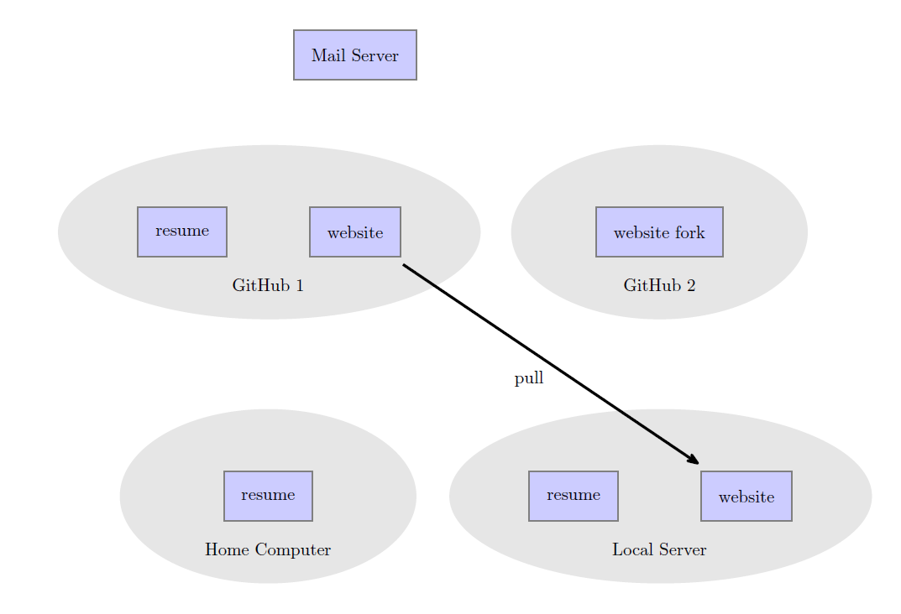

# Continuous Resume Project

This is my attempt to document a project which has 
become relatively spread-out. The project is a resume
updating system, which is located partially in my (private) resume repository, 
and partially in my website_updater repository. It uses a script from my linux-scripts repository, and 
ends up affecting my website (pecan-pine.github.io) repository. 

In its current form, I have resume
data stored in a MongoDB database. The data gets fed into 
several Jinja templates to produce resumes with slightly different
content and several different file types. 

Here is a brief history of the project:

## Starting Point:

Before I started this project, I had different .tex files
storing different versions of my resume. For example, I had a 
teaching resume, and a software development resume. Each 
resume had slightly different content to emphasize different 
skills of mine, or different points in my career. 

When I made my website, I created JavaScript functions
which would insert an HTML version of my resume into different
parts of the website. To do this, I needed to have an HTML 
resume. So I wrote a Python program to parse the LaTeX code 
and re-write it into HTML. This generally needed a little bit of 
editing afterwards, so updating my website after updating my resume
was tedious. 

Problems:
- Changing format for multiple copies is tedious
- Making python convert .tex to .txt and .html is error-prone
- Many copies of mostly the same file
- Difficult to maintain

## Second iteration

My solution was to do the following:
- Separate LaTeX code into "components": Python string variables storing LaTeX code. For example:
    - Education (one variable for each school)
    - Work Experience (one variable for each employer)
    - Projects (one variable per project)
- A specification file to organize which components go into which resume type. 
- One Python program makes all versions of the resume, using one very simple LaTeX template. 

Problems:
- Only produces .tex files (other file types produced by having Python read the LaTeX code)
- Post-processing to get .txt/.html resumes is unreliable
- Updating website is still the same process

## Third iteration

Solution:
- Refactor components into Python dictionaries storing plaintext (now 
this is a MongoDB database storing plaintext).
    - Information is more granular, for example school GPA is stored but does not need to be included in every resume. 
- Dictionaries are fed into Jinja templates to produce resumes (one
template for each file type).
- From the specifications, templates, and components, the program
produces .tex, .txt, .html, and .md versions of resume for each resume specification.
- Easy to change data / format. 
- Easy to fix typos.

Problem:
- There are still 4 templates to maintain, with similar information in each. 
- Updating website is still tedious.
- Need to have website repository downloaded on the same computer as 
my resume in order to update the website. 

## Fourth iteration

I set up a script to run on a server whenever I push changes in my resume project. The current version of the script is written in Bash (earlier versions were Python/Bash). Whenever I push changes, the script checks whether those changes affected the website. If changes are detected, the script copies the website files to my website repository, pushes those changes, and makes a pull request to my website project so I can review the changes. 

Here are the steps in detail:

1. Push resume changes to GitHub and a local server. The push activates a Git hook which first determines if the website-related resume files have changed. 

2. If website-related files have changed, it then pulls the latest website repository to make sure files are up to date. 

3. Copy files into website repository. 

4. Push changes to a second GitHub account, then make a pull request for the main website project. GitHub then sends me an email about the pull request. 

5. I can review changes, and if everything has gone right, update the website. 

Problems:
- Two GitHub accounts is probably not necessary. I started out with
two accounts since I was originally using a remote server, and 
wanted to keep my main GitHub account secure. 
- Making the JavaScript/HTML files still happens on my computer.
It would be nice for the server to do HTML processing. 
- Currently when I push changes to my resume project, it takes a few 
seconds, and there is good bit of output. It might be nice to change It
so that the process happens in the background and I don't have to 
wait for it to finish. 

Here is the full picture:

## Conclusion:

Overall I am happy with the state of the project, but I intend to keep developing it. Some things I am planning on doing:

- Make a demonstration version of the entire system. Currently the resume templates and database are specific to my resume. 
    - Using MongoDB Atlas would probably work for the database, so that anyone could access it. 
- Generalize somewhat. What other documents could I produce using a similar method?

Some things I am not planning to do any time soon, but that would be nice:

- Make a GUI selection system to enter in resume specifications. 
- Make a WYSIWYG editor which would produce Jinja templates by emulating an example document.
